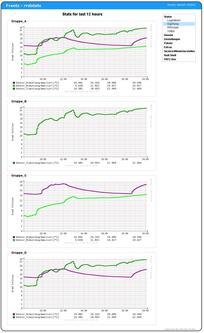

# DigiTemp 3.7.2 (binary only)

### **Was ist digitemp?**

[](../../docs/screenshots/120.jpg)

Digitemp ist eine Software zum Auslesen von 1-Wire Temperatursensoren
als auch anderen von Dallas zur Verfügung gestellten 1-Wire Komponenten,
z.B. DS1820.

### Wichtiger Hinweis

 * Egal was in
irgendeiner Anleitung im Internet steht, es MÜSSEN alle 3 Beinchen der
Sensoren verbunden werden!
Ob es nun eine eigene Stromversorgung oder Masse ist, bleibt euch
überlassen. Ansonsten befinden sich die Sensoren in einem nicht
definierten Zustand und melden je nach Wetter Fantasiewerte.

### Tipp bei Verwendung mehrerer USB-RS232-Adapter an einer Fritzbox

Wer mehrere USB-RS232-Adapter an seiner Fritzbox verwendet und das
Problem hat, dass diese mal */dev/ttyUSB0*, mal */dev/ttyUSB1* usw.
heißen, kann mit folgendem Eintrag in *rc.custom* einen Adapter mit
pl2303-Chip fest auf ein Device legen (mittels Softlink - danke an kuppe
für diesen Tipp in
[diesem](http://www.ip-phone-forum.de/showthread.php?p=1586380#post1586380)
bzw.
[diesem](http://www.ip-phone-forum.de/showthread.php?t=221189)
Thread!):

```
	# digitemp-Link erstellen (pl2303)
	USBNR=$(grep 2303 /proc/tty/driver/usbserial | cut -d ":" -f1)
	ln -s /dev/ttyUSB$USBNR /dev/digitemp
```

Die Device ID findet man mit *lsusb-freetz* heraus (Package selection →
Debug helpers → usbutils). Ein Blick nach */proc/tty/driver/usbserial*
hilft auch weiter, z.B. könnte das Resultat so aussehen (bei 2 Adaptern
mit je einem pl2303- bzw. einem ftdi-Chipsatz):

```
	root@fb1 /var/mod/root $ cat /proc/tty/driver/usbserial
	usbserinfo:1.0 driver:v2.0
	0: module:ftdi_sio name:"FTDI USB Serial Device" vendor:0403 product:6001 num_ports:1 port:1 path:usb-ahci_hcd-1.1
	1: module:pl2303 name:"PL-2303" vendor:067b product:2303 num_ports:1 port:1 path:usb-ahci_hcd-1.2
```

Falls man also statt eines pl2303-Chip Adapters einen mit FTDI-Chip fest
verdrahten will, müsste obiger Code so aussehen:

```
	# digitemp-Link erstellen (ftdi)
	USBNR=$(grep ftdi /proc/tty/driver/usbserial | cut -d ":" -f1)
	ln -s /dev/ttyUSB$USBNR /dev/digitemp
```

Bei RRDstats → Einstellungen ist unter "Serieller Port:" dann
natürlich entsprechend */dev/digitemp* zu wählen (statt */dev/ttyUSB0*
o.ä.).

### Datenbank

Bis zu [r11010](https://trac.boxmatrix.info/freetz-ng/changeset/11010)
konnte mit einem Intervall von 60 Sekunden 146 Tage aufgezeichnet
werden, mit 150 Sekunden 1 Jahr. Ab dieser Revision werden die
Datenbanken von DigiTemp und RRDstats-Kabelsegment mit 2 Jahren bei 60
Sekunden *erstellt*. Damit wachsen die einzelnen Dateien von ~85kB
auf ~150kB.
Existierende rrd-Datenbanken kann man so neue RRAs hinzufügen (für
experimentierfreudige):

```
	## box
	rc.rrdstats stop
	rc.rrdstats backup
	for x in *.rrd; do rrdtool dump $x > ${x%rrd}xml; done
	#rm -rf *.rrd

	## pc
	rm -rf rrdtoolx.py 2>/dev/null
	wget 'http://minkirri.apana.org.au/~abo/projects/rrdcollect/rrdtoolx.py'
	chmod +x rrdtoolx.py
	# fix for parsing '<min> 0.0000000000e+00 </min>' => '(0, 0.0)' -> 0
	sed "s/+ cmd/&.replace('(0, 0.0)','0')/g" -i rrdtoolx.py
	# fix for parsing '<min> -6.7000000000e+01 </min>' => '(-6, 70000000000.0)' -> -67
	sed "s/+ cmd/&.replace('(-6, 70000000000.0)','-67')/g" -i rrdtoolx.py
	# fix for parsing '<min> 2.5700000000e+02 </min>' => '(2, 570000000000.0)' -> 257
	sed "s/+ cmd/&.replace('(2, 570000000000.0)','257')/g" -i rrdtoolx.py

	# xml > rrd
	for x in *.xml; do rrdtool restore $x ${x%xml}rrd; done
	rm -rf *.xml
	# rrd > out
	for x in *.rrd; do ./rrdtoolx.py addrra $x ${x%rrd}out RRA:MIN:0.5:360:2920 RRA:AVERAGE:0.5:360:2920 RRA:MAX:0.5:360:2920; done
	rm -rf *.rrd
	# out > xml
	for x in *.out; do rrdtool dump $x > ${x%out}xml; done
	rm -rf *.out
	# fix newer dump format
	sed '1,2d' -i *.xml

	## box
	for x in *.xml; do rrdtool restore $x ${x%xml}rrd; done
	rm -rf *.xml
	rc.rrdstats restore
	rc.rrdstats start
```

### Weiterführende Links

-   Anleitung zur Hardware:
    [http://lena.franken.de/hardware/temperaturmessung.html](http://lena.franken.de/hardware/temperaturmessung.html)
-   Einbau einer zusätzlichen Stromversorgung:
    [http://public.rz.fh-wolfenbuettel.de/~hamannm/general/digitempd.html](http://public.rz.fh-wolfenbuettel.de/~hamannm/general/digitempd.html)
-   Anleitung digitemp und rrdtool:
    [http://www.arbeitsplatzvernichtung-durch-outsourcing.de/marty44/rrdtool.html](http://www.arbeitsplatzvernichtung-durch-outsourcing.de/marty44/rrdtool.html)
-   Thread "[[Trunk #3003] Visualisierung von
    DigiTemp](http://www.ip-phone-forum.de/showthread.php?t=183491)"
    im IP-Phone-Forum (nicht auf Trunk [r3003](https://trac.boxmatrix.info/freetz-ng/changeset/3003)
    beschränkt, sondern stetig aktualisiert)

