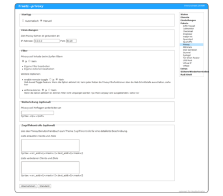

# Privoxy 3.0.34
 - Homepage: [https://www.privoxy.org](https://www.privoxy.org)
 - Manpage: [https://www.privoxy.org/user-manual/](https://www.privoxy.org/user-manual/)
 - Changelog: [https://www.privoxy.org/gitweb/?p=privoxy.git;a=blob;f=ChangeLog](https://www.privoxy.org/gitweb/?p=privoxy.git;a=blob;f=ChangeLog)
 - Repository: [https://www.privoxy.org/gitweb/?p=privoxy.git](https://www.privoxy.org/gitweb/?p=privoxy.git)
 - Package: [master/make/pkgs/privoxy/](https://github.com/Freetz-NG/freetz-ng/tree/master/make/pkgs/privoxy/)
 - Maintainer: -

[Privoxy](http://www.privoxy.org) ist ein HTTP
Proxy mit umfangreichen Filtermöglichkeiten zum **Schutz der
Privatsphäre** und zum Filtern von Webseiten-Inhalten: Privoxy
**entfernt Werbung und Popups**, bietet eine vollständig konfigurierbare
**Zugriffskontrolle** auf das Internet ("Kindersicherung") sowie die
Verwaltung und Kontrolle von Cookies.

Das Privoxy Paket enthält neben einem vorkompilierten Privoxy mitsamt
Standardkonfiguration vordefinierte Standard-Filter sowie ein
Webfrontend zur Konfiguration. Das nachstehende Bild zeigt die Version
ab Revision 2938 (neu hinzugekommen sind die Optionen
enable-remote-toggle und enforce-blocks)

[](../screenshots/11.png)

### Filter und Aktionen

Eine detailierte Beschreibung der mächtigen und umfangreichen
Filter-Funktionen liefert das [Privoxy
Benutzerhandbuch](http://www.privoxy.org/user-manual/) in den
Kapiteln [Filter
Files](http://www.privoxy.org/user-manual/filter-file.html)
und [Actions
Files](http://www.privoxy.org/user-manual/actions-file.html)
(englisch).

### Zugriffskontrolle

Die Privoxy Zugriffskontrolle ist über das Freetz Webinterface
steuerbar. Eine detailierte Beschreibung dazu findet man ebenfalls im
[Privoxy
Benutzerhandbuch](http://www.privoxy.org/user-manual/) im
Kapitel
[Zugriffskontrolle](http://www.privoxy.org/user-manual/config.html#ACCESS-CONTROL)
(englisch).

### Privoxy und Tor

Privoxy ist auch ideal für die Verwendung zusammen mit
[Tor](tor.md), um anonym und sicher im Internet surfen zu
können.

Dazu muss in der Privoxy Konfiguration der Port und der IP-Adresse des
Tor Proxy Servers angeben werden. Wenn der Tor Proxy auf der selben
Fritzbox läuft, so kann man z.B. *127.0.0.1:9050* eintragen.

### Transparenter Proxy

In manchen Fällen ist es gewünscht, dass jeglicher Webtraffic durch den
Proxy geleitet wird und so ohne Konfiguration auf dem Client-PC zu
filtern. Dazu wird zusätzlich [Iptables](iptables.md) mit den
Modulen **ip_tables**, **iptable_filter**, **x_tables**,
**xt_tcpudp**, **ipt_REDIRECT**, **ip_nat** und **iptable_nat**
benötigt.

Um die Umleitung zu aktivieren folgendes ausführen (Konsole oder
rc.custom):

```
modprobe ip_tables
modprobe iptable_filter
modprobe x_tables
modprobe xt_tcpudp
modprobe ipt_REDIRECT
modprobe ip_nat
modprobe iptable_nat
iptables -t nat -A PREROUTING -p tcp -i lan --dport 80 -j REDIRECT --to 8118
[ -z "$(grep accept-intercepted-requests /var/mod/etc/privoxy/config)" ] && echo "accept-intercepted-requests 1" >> /var/mod/etc/privoxy/config
```

### Werbefilter

Um den Privoxy als Werbefilter zu nutzen ist es notwendig eine aktuelle
und gute Filterliste zu haben. Um die Daten nicht selbst pflegen zu
müssen ist es hilfreich beispielsweise auf die Filterlisten des
Firefox-Plugins AdBlockPlus zuzugreifen.
Da diese Listen ziemlich groß sind, wird es im Flashspeicher der
Fritz.Box etwas eng. Deswegen ist es nützliche die Listen beim Start der
Fritz.Box neu zu laden.

```
URL="http://adblockplus.mozdev.org/easylist/easylist.txt"
ACTION=/var/tmp/flash/privoxy/user.action
FILTER=/var/tmp/flash/privoxy/user.filter
FILE=$(basename ${URL})
LIST=${FILE%.*}
wget -qO ${FILE} ${URL}
echo -e "{ +block{${LIST}} }" > ${ACTION}
sed '/^!.*/d;1,1 d;/^@@.*/d;/$.*/d;/#/d;s/././g;s/?/?/g;s/*/.*/g;s/(/(/g;s/)/)/g;s/[/[/g;s/]/]/g;s/^/[/&:?=_]/g;s/^||/./g;s/^|/^/g;s/|$/$/g;/|/d' ${FILE} >> ${ACTION}
echo "FILTER: ${LIST} Tag filter of ${LIST}" > ${FILTER}
sed '/^#/!d;s/^##//g;s/^#(.*)[.*][.*]*/s|<([a-zA-Z0-9]+)s+.*id=.?1.*>.*</1>||g/g;s/^#(.*)/s|<([a-zA-Z0-9]+)s+.*id=.?1.*>.*</1>||g/g;s/^.(.*)/s|<([a-zA-Z0-9]+)s+.*class=.?1.*>.*</1>||g/g;s/^a[(.*)]/s|<a.*1.*>.*</a>||g/g;s/^([a-zA-Z0-9]*).(.*)[.*][.*]*/s|<1.*class=.?2.*>.*</1>||g/g;s/^([a-zA-Z0-9]*)#(.*):.*[:[^:]]*[^:]*/s|<1.*id=.?2.*>.*</1>||g/g;s/^([a-zA-Z0-9]*)#(.*)/s|<1.*id=.?2.*>.*</1>||g/g;s/^[([a-zA-Z]*).=(.*)]/s|1^=2>||g/g;s/^/[/&:?=_]/g;s/.([a-zA-Z0-9])/.1/g' ${FILE} >> ${FILTER}
echo "{ +filter{${LIST}} }" >> ${ACTION}
echo "*" >> ${ACTION}
echo "{ -block }" >> ${ACTION}
sed '/^@@.*/!d;s/^@@//g;/$.*/d;/#/d;s/././g;s/?/?/g;s/*/.*/g;s/(/(/g;s/)/)/g;s/[/[/g;s/]/]/g;s/^/[/&:?=_]/g;s/^||/./g;s/^|/^/g;s/|$/$/g;/|/d' ${FILE} >> ${ACTION}
echo "{ -block +handle-as-image }" >> ${ACTION}
sed '/^@@.*/!d;s/^@@//g;/$.*image.*/!d;s/$.*image.*//g;/#/d;s/././g;s/?/?/g;s/*/.*/g;s/(/(/g;s/)/)/g;s/[/[/g;s/]/]/g;s/^/[/&:?=_]/g;s/^||/./g;s/^|/^/g;s/|$/$/g;/|/d' ${FILE} >> ${ACTION}
```

Nähere Infos unter:
[http://andrwe.org/doku.php/scripting/bash/privoxy-blocklist](http://andrwe.org/doku.php/scripting/bash/privoxy-blocklist)

If you want to store the action and filter file external in stead of
flash:

```
ACTION=/var/media/ftp/uFlash/privoxy/user.action
FILTER=/var/media/ftp/uFlash/privoxy/user.filter
```

```
rm /tmp/flash/privoxy/user.filter
rm /tmp/flash/privoxy/user.action
ln -s /var/media/ftp/uFlash/privoxy/user.filter /tmp/flash/privoxy/user.filter
ln -s /var/media/ftp/uFlash/privoxy/user.action /tmp/flash/privoxy/user.action
modsave
```

### Installation

Das Paket kann während der
[Freetz-Installation](../help/howtos/common/install.html) einfach
mit ausgewählt werden, und wird somit Bestandteil der selbstgebauten
Firmware.

### Diskussion

Fragen und Anmerkungen zu diesem Paket werden in [diesem
Thread](http://www.ip-phone-forum.de/showthread.php?t=115778)
diskutiert.

