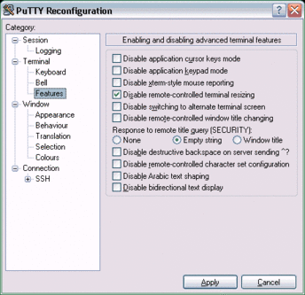

# Screen 4.6.2

*"Screen is a full-screen window manager that multiplexes a physical
terminal between several processes, typically interactive shells."*
[http://www.gnu.org/software/screen/](http://www.gnu.org/software/screen/)

*screen* erzeugt eine Shell welche auch nach einem Ausloggen bestehen
bleibt und die man aushängen (detach) und sich auch beliebig wieder
einhängen (attach) kann, jedesmal wird dabei der Bildschirm
wiederhergestellt, auch wenn er sich verändert haben sollte.

### Bedienung

*screen* kann ohne alles aufgerufen werden und bietet dann eine ganz
normale Shell an. *screen* kann aber auch mit einem Befehl als Argument
aufgerufen werden, woraufhin dieser ausgeführt wird bis er sich selbst
beendet oder der Prozess beendet wird. Oder auch: die Daemon-Version für
Arme (den jeder Prozess ist so im Hintergrund ausführbar ohne als Daemon
programmiert worden zu sein).

### aushängen/detach

Mit *CTRl+A* und dann *D* kann man sich aus einer Shell aushängen die
auch dann im Hintergrund weiterläuft.

### einhängen/attach

Ausserhalb der ausgehängten Shell kann man mit `screen -x` sich in die
Shell einhängen aus der man sich ausgehangen hat (wenn es nur eine gibt)
Mit `screen -list` kann man sich eine Liste der Shells anzeigen die im
Hintergrund laufen. Die Namen (die man mit `screen -t <neuerName>`
ändern kann) werden dazu benutzt mit `screen -r <Name>` ausgewählt zu
werden.

### PuTTY-Tip: Änderung der Fensterbreite beim Screen-Start verhindern

Kleiner Tip für *PuTTY*-Benutzer: Beim Starten von *screen* verändert
das Programm gern mal eigenmächtig die Fensterbreite auf 80 Zeichen. Man
kann das entweder durch eine entsprechende Einstellung in *screen*
verhindern (Kommando
[termcapinfo](http://lists.gnu.org/archive/html/screen-users/2005-10/msg00006.html)),
wovon ich aber nicht genug verstehe, oder man kann durch eine
*PuTTY*-Einstellung serverseitige Größenänderungen am Terminal verbieten
- siehe Bild. Trotzdem kann man noch clientseitig die Fenstergröße
verändern.

### Weiterführende Links

-   [Screen](http://de.wikipedia.org/wiki/Screen)
    bei Wikipedia

