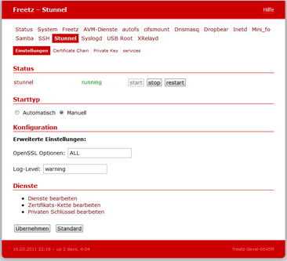

# Stunnel 5.57

[](../screenshots/202.png)

*"Stunnel is a program that allows you to encrypt arbitrary TCP
connections inside SSL (Secure Sockets Layer) available on both Unix and
Windows. Stunnel can allow you to secure non-SSL aware daemons and
protocols (like POP, IMAP, LDAP, etc) by having Stunnel provide the
encryption, requiring no changes to the daemon's code. "*
[http://www.stunnel.org/](http://www.stunnel.org/)

**Stunnel** könnte man auf Deutsch mit "Sicherer Tunnel" wiedergeben.
Hinter dem Begriff verbirgt sich die Möglichkeit, beliebige TCP
Verbindungen per SSL zu verschlüsseln - auch bzw. gerade wenn die
Anwendung selbst dies nicht unterstützt, und somit dem
"Man-in-the-Middle" das Schnüffeln zu verderben. Zahlreiche gute
Anwendungsbeispiele finden sich auf der [Stunnel
Homepage](http://www.stunnel.org/examples/).

### Konfiguration

1.  Erzeugen der Keys auf dem PC (unter Linux):

    ``` 
    openssl genrsa 1024 > host.key
    openssl req -new -x509 -nodes -sha1 -days 365 -key host.key > host.cert
    ```

2.  Das Zertifikat und den Schlüssel im Webinterface unter Einstellungen
    → Stunnel: "Certificate Chain" (host.cert) und "Private Key"
    (host.key) einfügen.

<!-- -->

3.  Die gewünschten Services hinzufügen. Zum Beispiel:

    ``` 
    [freetz https Web-Interface]
    client = no
    cert = /tmp/flash/stunnel/certs.pem
    key = /tmp/flash/stunnel/key.pem
    accept = 4433
    connect = 81
    ```

    Die Angabe des Pfads zum Zertifikat und zum Schlüssel sind optional.
    Ohne ausdrückliche Angabe wird das Zertifikat
    */tmp/flash/stunnel/certs.pem* und der Schlüssel
    */tmp/flash/stunnel/key.pem* verwendet, welche vom Webinterface aus
    verwaltet werden (Punkt 2).

<!-- -->

4.  Zugriff (intern) über
    [https://fritz.box:4433](https://fritz.box:4433).
    Für den externen Zugriff muss noch eine Port-Freigabe eingetragen
    werden.

### Weiterführende Links

-   [Wikipedia](http://en.wikipedia.org/wiki/Stunnel)
    (EN) Article
-   [Stunnel.ORG](http://www.stunnel.org/) ---
    Stunnel Homepage
-   [matrixtunnel](matrixtunnel.md) --- kleiner Stunnel Ersatz
-   [xrelayd](xrelayd.md) --- Nachfolger von Matrixtunnel
-   [Artikel im
    Forum](http://www.ip-phone-forum.de/showthread.php?t=123174)

