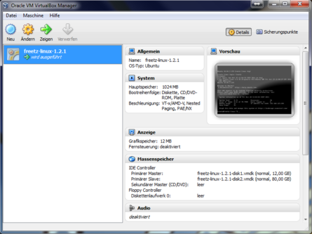
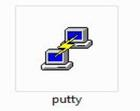
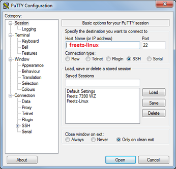
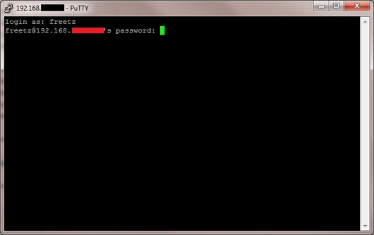
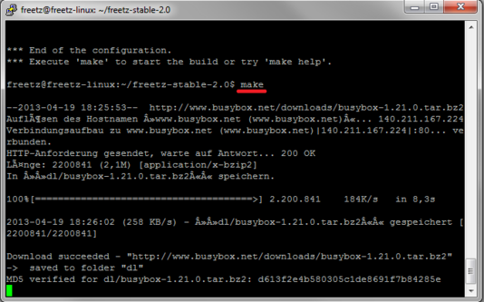
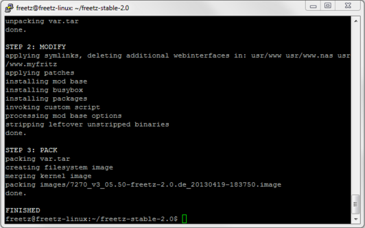
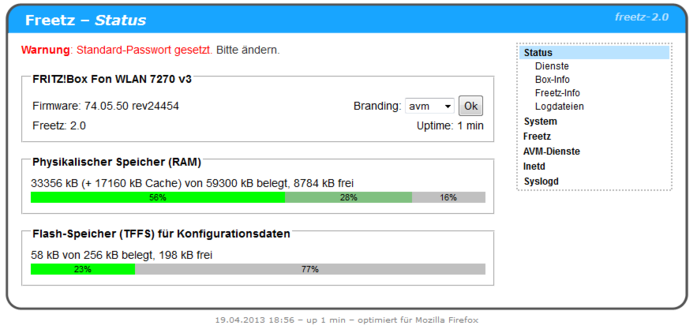

# Freetz für Anfänger

### Fragen im Vorfeld

### Was ist Freetz?

Eine Beschreibung sowie eine kurzen historischen Überblick über Freetz
findet ihr hier.


### Was brauche ich um ein Freetz-Image erstellen zu können?

0.) Sichern wichtiger (Zugangs-)Daten, z.B. Internet Service Provider,
WLAN, VoIP, Telefonliste, etc.
1.) [Aktuelles
Recovery-Image](ftp://ftp.avm.de/fritz.box) für deine Box
bereithalten z.B.
[7170](ftp://ftp.avm.de/fritz.box/fritzbox.fon_wlan_7170/x_misc/deutsch/)
oder
[7270](ftp://ftp.avm.de/fritz.box/fritzbox.fon_wlan_7270/x_misc/deutsch/).
 Nach
einem fehlgeschlagenen Firmware-Update kommst du nicht mehr ins
Internet, um dir ein Recovery-Image zu besorgen.
2a.) Ein natives Linux-Betriebssytem, z.B.
[Ubuntu](http://www.ubuntu.com/) (Einsteiger),
Fedora (Fortgeschrittener) oder Debian (Universalist).
oder\
2b.) Ein virtuelles Linux-Betriebssytem, z.B.
[Freetz-Linux](http://www.ip-phone-forum.de/showpost.php?p=1400234&postcount=1)
in einer virtuellen Maschine (z.B.
[VirtualBox](https://www.virtualbox.org/wiki/Downloads)
oder [VMware
Player](http://www.vmware.com/de/download/player/))
installieren. (Alternativen: [Ubuntu 10.04 LTS Abbild
648MB](http://www.ip-phone-forum.de/showthread.php?t=204858)
(VMWare & VirtualBox),
[speedlinux](http://wiki.ip-phone-forum.de/skript:andlinux)
(coLinux als VM, 32bit)\


Freetz-Linux steht seit Version 1.2 nur als Virtualbox OVA Datei bereit.
Wer es weiterhin unter VMWare laufen lassen möchte, findet
hier
ein paar Hinweise (ohne Gewähr).

3.) Einen SSH-Client wie z.B.
[PuTTY](http://the.earth.li/~sgtatham/putty/latest/x86/putty.exe),
damit kann man sich via SSH oder Telnet ins Freetz-Linux einloggen.
4.) Genügend Speicherplatz auf Festplatte für Betriebssystem-Updates,
lokalen Download-Ordner "freetz/dl" etc. ([Limitierungen bei
Dateisystemen](http://en.wikipedia.org/wiki/Comparison_of_file_systems#Limits)
beachten). Minimum: 5GiB (VM), Bevorzugt: 10GiB (nativ).

 Die
folgende Beschreibung ist auf Freetz-Linux zugeschnitten.


### Was sollte ich bedenken?

Vergiss nicht, dass deine Box in erster Linie ein Router mit
Telefonanlage ist. Wenn Du die Firmware modifizierst, kann es vorkommen,
dass die Hauptfunktionen der Box dadurch beeinträchtigt werden. Im
Normalfall sollte dies nicht passieren, kann sich aber zum Beipsiel
dadurch äußern, dass sich die Box aufhängt oder unerwartet neu startet.
Bei der Paketauswahl solltest du folgende Regel befolgen: Wenn Du nicht
mehr als zwei Sätze zu einem Paket sagen kannst, dann hat es auf Deiner
Box nichts zu suchen! Sei bitte vorsichtig mit den Patches. Nicht alle
und nicht in jeder Kombination wirst Du sie brauchen.
Für den Anfang wird empfohlen von komplizierten Sachen, wie z.B.
"Replace Kernel" oder Einsetzen von eigenen Modulen, die Finger zu
lassen. Nicht alles, was cool klingt ist es in Wirklichkeit auch.


### Was soll mein erstes Freetz-Image können?

Ihr solltet Euch folgende Frage stellen: ***"Was will ich mit Freetz
erreichen?"*** bzw. ***"Was kann meine Box noch nicht und ich kann es
dann durch Freetz erreichen?"***\
Freetz ist keine Modifikation an sich, sondern eher eine
Entwicklungsumgebung, in der Modifikationen modular an der Firmware der
Box vorgenommen werden. Damit lassen sich sehr nette Sachen mit der
FritzBox anstellen, da man an das zu Grunde liegende Linux herankommt
und eigene Programme auf der Box ausführen kann. Die Liste der Pakete
spiegelt die bisherigen Bedürfnisse der Nutzer wieder. Jeder kann sich
seine Wunsch-Firmware selbst aus den bereits vorhandenen Bausteinen
(Paketen) zusammenstellen, eigene Pakete hinzufügen oder nicht benötigte
weglassen und so bewußt entscheiden, welche Funktionen seine FritzBox
künftig haben soll.

Als erstes solltet Ihr Euch informieren welche Pakete in eurem neuen
Image überhaupt Sinn machen: Liste der möglichen Pakete und Erweiterungen.


### Warum sollte ich mit einem Minimal-Image am Anfang starten?

Um überhaupt erstmal zu sehen was wie funktioniert und wie z.B. das Menü
nach dem ersten Flashen aussieht, empfiehlt es sich gerade für
Neueinsteiger eine Minimalkonfiguration herzustellen und einzuspielen.
Anfragen zur Fehlerbehebung und nach weiteren Plugins sind für das
Freetz-Team viel einfacher zu beantworten, wenn ein Minimal-Image
benutzt wird.


### Wie muß ich meinen PC einstellen damit ich ein Image bauen kann?

Hinweise zur Einstellung eures PC's findet ihr
hier

### Wie baue ich mein erstes eigenes Image (Minimal-Image)

Also dann legen wir los und machen genau das was hier steht, auch wenn
eigentlich später mehr Pakete ins Image sollen.
Vorher gilt es nochmal einen kurzen Check zu machen.

-   Welche Box besitze ich (7141, 7270, 7390, usw.)?
-   Wieviel Arbeitsspeicher hat meine Box (16, 32, 64 oder 128 MB)?
-   Wie groß ist der Flash-Speicher meiner Box (4, 8 oder 16 MB)?
-   Habe ich ein LAN-Kabel das funktioniert ? Sollte was schief gehen
    kann die Box nur über den LAN Anschluß gerettet werden (mit Wlan ist
    das nicht möglich)
-   Habe ich ein Backup der bestehenden Konfiguration gemacht?
    (Einstellungen → System → Einstellungen sichern)
-   Ich habe das korrekte Recover Image für meine FritzBox.
    [AVM FTP Server](ftp://ftp.avm.de/fritz.box/) →
    Box → x_misc → z.B deutsch → ...recoverimage.....exe (zum Ausführen
    wird Windows benötigt)
-   Ich weiß wie ich das Recover im Fall eines Falles durchführe? Wenn
    nicht hilft dieser [Link zu
    AVM](http://www.avm.de/de/Service/FAQs/FAQ_Sammlung/12798.php3)
    oder diese [Offline
    PDF](http://www.router-faq.de/fb/recover/firmware-recover.pdf)
    von Router-FAQ.
-   Mein Linux ist konfiguriert und alle für Freetz benötigten Pakete?
-   Die aktuelle Firmware meiner Box wird von Freetz unterstützt?
    Unterstütze Boxen und Firmwares\

Nun geht es ans Bauen des Minimal-Images:\

-   Diese Anweisung ist für alle die geschrieben, die zum ersten Mal
    Ihre Fritzbox mit FREETZ modifizieren wollen.
-   Wir geben hier keinerlei Garantie für die Richtigkeit unserer
    Beschreibung oder eine Gewährleistung für evtl. auftretende Schäden
    die Aufgrund unserer Beschreibung entstehen können!\
-   Mit Freetz kann der Funktionsumfang von AVM FritzBox Routern
    erweitert werden.
-   Das Freetz-Buildsystem ist Linux basierend und kann entweder nativ
    unter Linux oder in einer virtuellen Maschine ausgeführt werden. Da
    die meisten PCs mit dem Betriebssystem Windows ausgeliefert werden
    konzentrieren wir uns in dieser Beschreibung auf den Fall virtuelle
    Maschine.
-   Freetz erstellt ein neues Firmwareimage, welches wie eine offizielle
    Firmware von AVM direkt über das Webinterface der FritzBox in den
    Router geladen werden kann. Welche Programmpakete das Image
    enthalten soll entscheidet ihr selbst. Die Auswahl ist nur durch den
    freien Platz im Flash des Routers begrenzt.

### Starten von Freetz

Nun starten wir das Programm VirtualBox und wählen über Datei→Appliance
importieren das heruntergeladene Image aus (freetz-linux-1.3.1.ova). Das
Image wird jetzt für die Nutzung in VirtualBox vorbereitet. Dieser
Schritt kann ein wenig dauern. Falls euer PC einen Prozessor mit mehr
als einem Kern hat, dann könnt ihr über Ändern→System→Prozessor die
Anzahl Prozessoren der virtuellen Maschine erhöhen. Desweiteren solltet
ihr, wenn Virtual Box einen Fehler bezüglich der Konfiguration meldet
auf Ändern klicken und die Einstellungen kontrollieren. Danach kann man
das Einstellungsfenster wieder schließen und die virtuelle Maschine
starten. Nach dem Start von Freetz-Linux meldet ihr euch mit dem
Benutzer **freetz** und Passwort **freetz** an und bestätigt jede
Eingabe mit der Returntaste. (Hinweis: Bei der Eingabe des Passwortes
werden die Zeichen nicht auf dem Bildschirm angezeigt.)\

[](../../screenshots/226.png)

[](../../screenshots/227.png)

### PuTTY starten

Als nächstes starten wir Putty am PC. Putty ist hier zu finden:
[Putty-Download](http://the.earth.li/~sgtatham/putty/latest/x86/putty.exe)\
Als nächstes sollte folgendes Bild erscheinen.
Dort einmalig auf der linken Seite **Window**→**Translation** auswählen
und in der Auswahlliste auf der rechten Seite **UTF-8** auswählen. Auf
der linken Seite dann wieder **Session** auswählen und rechts den Button
**Save** drücken. Damit kann Putty auch die Umlaute richtig anzeigen.
Zum Verbinden gebt ihr dann **freetz-linux** als Host Name eurer VM
(Freetz-Linux) ein und bestätigt das ganze mit **Open**.

[](../../screenshots/148.jpg)

[](../../screenshots/149.png)

[](../../screenshots/150.jpg)

Die Zugangsdaten für PuTTy sind die gleichen wie oben. (Auch hier wird
bei der Passwort-Eingabe kein Echo angezeigt.)\
So, nachdem ihr PuTTy mit Freetz-Linux verbunden habt solltet ihr
Freetz-Linux auf den aktuellen Softwarestand bringen. Dazu gebt ihr
folgende Befehle ein:\

> **sudo apt-get update** (Paketlisten auf den neuesten Stand bringen)\
> **sudo apt-get -d upgrade** (Updates herunterladen)\
> **sudo apt-get -y upgrade** (Updates installieren)\

Die nun folgenden Abfragen werden durch Eingabe des Passwortes
**freetz** bestätigt. (Sollte eine Abfrage nach einem Update erscheinen,
dann bitte **die Pakete des Systembetreuers** aktivieren und mit **OK**
bestätigen). Solltet Ihr folgende Fehlermeldung sehen:**hostname konnte
nicht aufgelöst werden**, dann kontrolliert bitte die
Netzwerkkonfiguration und prüft ob eure virtuelle Maschine eine
IP-Adresse bekommen hat. Zum Überprüfen bitte folgenden Befehl in der VM
eingeben: **ifconfig**

```
eth0      Link encap:Ethernet  Hardware Adresse xx:xx:xx:xx:xx:xx
          inet Adresse:192.168.XXX.203  Bcast:192.168.XXX.255  Maske:255.255.255.0
          inet6-Adresse: XXXX::XXXX:XXXX:XXXX:XXXX/XX Gültigkeitsbereich:Verbindung
```

Wie auf dem Auszug zu sehen hat die VM die **192.168.XXX.203** als IP
bekommen. Die IP kann aber von System zu System anders lauten, das ist
Abhängig vom IP-Bereich eures Systems. Sollte euch jedoch dort gar keine
IP angezeigt werden, müsst ihr die Einstellungen eures PC's bzw. von
VirtualBox erneut überprüfen.


### Freetz Sourcen auschecken

Als nächstes gebt ihr folgenden Befehl ein:\

```
svn checkout https://svn.boxmatrix.info/freetz-ng/branches/freetz-stable-2.0
```

Nun wird der aktuelle stabile Freetz Source Code (hier: Version 2.0) aus
dem Subversion Repository geladen. Unter folgendem Link kann geprüft
werden, ob es ggf. bereits ein aktuelleres stable Release verfürbar ist:
[https://svn.boxmatrix.info/freetz-ng/tags/](https://svn.boxmatrix.info/freetz-ng/tags/).
Wenn der Download beendet ist steht folgende Abschlußmeldung auf dem
Bildschirm: **Checked out revision xxxx**, z.B. xxxx=10388. Tatsächlich
trägt freetz-2.0 die Revision 10388 (man beachte "Last Changed Rev:
10388" bzw. "Letzte geänderte Rev: 10388").

Auch nach dem Erscheinen (Release) von freetz-2.0 (stable) wird Freetz
ständig verbessert. Danach wechselt man mit **cd freetz-stable-2.0** in
das Freetz Verzeichnis und gibt **make menuconfig** ein.

### Einstellungen im menuconfig

Nach dieser Eingabe solltet Ihr folgendes Bild sehen:\

[](../../screenshots/154.png)

Dies ist die Konfigurations-Oberfläche des Freetz-Buildsystems. Dort
wählt ihr im ersten Anlauf nur den Router aus für den das Image bestimmt
ist. Für dieses HowTo haben wir Beispielhaft die 7270_V3 gewählt.
Nachdem der zu freetzende Router ausgewählt wurde, (Hardware type +
**Enter** drücken + mit erneutem **Enter** zurück ins Main-Menu) beendet
man menuconfig über den Button **EXIT** (welches man durch drücken der
Pfeil nach Unten-Taste erreicht)und bestätigt das ganze mit **Yes**.
Anschließend gibt man auf der Kommandozeile der Konsole ein **make**
ein. Der Erstellungsvorgang beginnt nun und ihr solltet ein solches Bild
sehen:

[](../../screenshots/156.png)

Beim ersten Build kann es je nach System und Internetanbindung sehr
lange dauern, weil alle benötigten Pakete erst einmal runtergeladen
werden müssen. Ist dies einmal geschehen und man passt in einem weiteren
Schritt seine Konfiguration nachträglich nochmal an geht es wesentlich
schneller. Während des Vorgangs gibt es etliche Warnungen. Am Ende
sollte dann aber eine Meldung ausgespuckt werden, dass das Image
erstellt worden ist. Das erstellte Image wird im Unterordner **images**
des Freetz Verzeichnisses abgelegt. Die Abschlussmeldung sieht wie folgt
aus:

[](../../screenshots/157.png)

Nun müssen wir nur noch das Image auf den PC kopieren.

### Image auf den PC kopieren

Info's findet ihr
hier.

### Freetz-Linux beenden

Euer Freetz-Linux könnt ihr entweder mit dem Befehl **sudo poweroff**
herunter fahren oder den Zustand der virtuellen Maschine abspeichern
indem ihr das VirtualBox Fenster schließt. Die Eingabe **sudo poweroff
*ist wieder mit dem bekannten Passwort zu bestätigen.***

### Der Flashvorgang

[](../../screenshots/184.png)

Hat man das Image auf dem PC, kann es losgehen. Allerdings sollte man
sicherstellen, dass man für die unwahrscheinliche Situation präpariert
ist, daß die Box nach dem Flashvorgang nicht durchstartet. Hierfür
sollte man folgende Vorbereitungen unbedingt treffen:\

> 1.) Recover Image herunterladen: Die jeweilige **Recover.exe** findet
> ihr auf der[AVM FTP
> Seite](ftp://ftp.avm.de/fritz.box)\
> 2.) Router auf die aktuelle AVM-Firmware updaten.
> 3.) DSL-Zugangsdaten bereithalten\
> 4.) Einstellungen der Fritzbox sichern\
> 5.) Sicherstellen, dass ein Passwort im AVM-WebIF gesetzt ist. Ein
> einfaches **0000** reicht, da sich sonst das neue Image nicht auf die
> Box spielen lässt

Hat man dies getan, kommt der große Moment. Hierfür im Webinterface der
Fritzbox unter **System → Firmware-Update** das Image auswählen und den
Update-Vorgang starten.
Nachdem die Firmware übertragen ist kommt nochmal ein Hinweis, daß es
sich um keine offizielle Firmware von AVM handelt, was bestätigt werden
muß. Danach sollte eure FB das Image einspielen und wieder problemlos
starten.

**Hinweis:** Seit der AVM-Firmware ab der Version 6.5x kann man nicht
mehr so einfach ein selbst gebautes Freetz-Image über den oben genannten
Weg zur Fritzbox hochladen. Seit diesem Zeitpunkt akzeptiert die
Fritzbox nur noch signierte Firmewares. Mehr zu diesem Thema findet ihr
im hier\

Das AVM-WebIF-Fenster zur Passwordeingabe sollte automatisch wieder auf
dem Bildschirm erscheinen. Sollte das AVM-WebIF nicht wieder autom.
gestartet werden, dann könnt ihr euch auch per Browser über
**[http://fritz.box](http://fritz.box)** einloggen.
Zusätzlich gibt es jetzt auch das Freetz-WebIF welches über die URL
**[http://fritz.box:81](http://fritz.box:81)**
erreichbar ist. Hier loggt man sich mit **admin** und **freetz** ein und
sieht jetzt das neue Freetz-Webinterface.
Glückwunsch! Euer erstes Freetz-Image befindet sich nun auf der Box.


