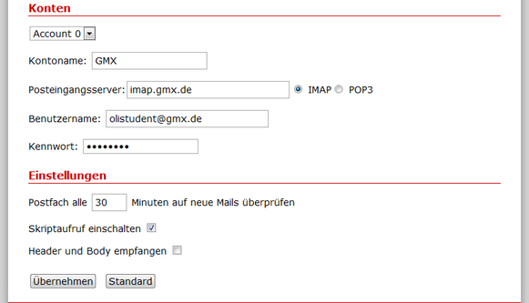

# Checkmaild 0.4.7

checkmaild ermöglicht es bis zu 3 Email-Konten (POP oder IMAP) in
festgelegten Intervallen auf neue Mails zu überprüfen. Bei Erhalt einer
neuen Mail wird ein Skript (maillog.cfg) aufgerufen. In diesem kann das
Mail-Event z.B. durch eine LED an der FritzBox signalisiert werden. Oder
über einen kurzen Telefonanruf auf ein Telefon bzw. Handy.

 * Es können
keine Konten über SSL-Verbindungen abgerufen werden!

**Unterschied von IMAP- und POP3-Konten:** Wenn die Mails über ein
IMAP-Konto abgerufen werden, dann werden die ungelesenen Mails (unread
mail) korrekt dargestellt. Eine neue Mail (new mail) wird im nächsten
Abrufintervall zur ungelesenen Mail. Da beim POP3-Zugriff das
*unseen*-Flag nicht verfügbar ist werden alle Mails im Posteingang als
ungelesen angezeigt.

Der Source von checkmaild stammt vom
[Tuxbox-Projekt](http://cvs.tuxbox.org/cgi-bin/viewcvs.cgi/tuxbox/apps/tuxbox/plugins/tuxmail/daemon/).

Konfiguration
-------------

[](../../README/screenshots/219.png)

Es können 3 verschiedene Mail-Accounts konfiguriert werden. Einzugeben
sind ein Kontoname, Benutzername, Kennwort und dann noch der POP- oder
IMAP-Server des Providers.

Weiterhin kann das Überprüfungsintervall sowie das Skript-Verhalten
festgelegt werden. Die Konfigurationsdatei kann unter
/mod/etc/checkmaild.conf eingesehen werden.

Skript-Funktion
---------------

Ab Version 0.4 gibt es zusätzlich die Möglichkeit einer Skript-Funktion.
Diese ist wie folgt zu benutzen (GMX als Beispiel):

```
/mod/etc/maillog.cfg 0 2 1 "GMX" "8d3451bca04e6c2f227257baa821c4b7" "14.Sep" "10:09" "User <user@gmx.de>" "Betreff"]
```

-   $1. Parameter: 0=New Mail received, 1=Status
-   $2. Parameter: Mails total
-   $3. Parameter: Current mail
-   $4. Parameter: Account
-   $5. Parameter: Message-ID
-   $6. Parameter: Datum
-   $7. Parameter: Uhrzeit
-   $8. Parameter: From
-   $9. Parameter: Subject

In den Variablen $2 bis $9 stehen die eMail-Infos, wenn Parameter $1
= "0" ist (Neue eMail empfangen).

Das Skript `/tmp/flash/checkmaild/maillog.cfg` kann über das
Webinterface entsprechend angepasst werden. Testen kann man, wenn
checkmaild im Vordergrund läuft und im Skript Ausgaben gemacht werden.

### LED-Signalisierung

TODO

### Telefon-Benachrichtigung

TODO

### Beispiel-Skripte

```
    (echo "$1 $2 $3 ...")
```

Beispiel:

```
    #!/bin/sh
    # neue Email empfangen
    if [ "$1" = "0" ];
    then
       echo "Am $6 um $7 Uhr schrieb $8: $9"
    fi
```

Und wenn man das jetzt in Verbindung mit dem callmonitor und dem Skript
callaction auf einem VDR ausgeben will, sieht das Beispiel so aus:

```
    #!/bin/sh
    # neue Email empfangen
    if [ "$1" = "0" ];
    then
       callaction vdr m741 "Am $6 um $7 Uhr schrieb $8: $9"
    fi
```

Hintergrundinfos zum callmonitor kann man auch hier im Wiki unter
[callmonitor](../callmonitor/README.md) nachlesen.

Weiterführende Links
--------------------

-   [IPPF
    Thread](http://www.ip-phone-forum.de/showthread.php?t=176375):
    POP3/IMAP Konten mit *checkmaild*

