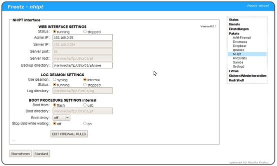
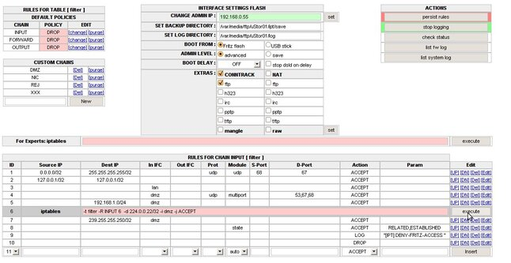

# NHIPT Iptables CGI 0.8.3a - EXPERIMENTAL

[](../../README/screenshots/178.jpg)

### MOTIVATION

> iptables ist ein Kommandozeilen User Interface zur Konfiguration /
> Verwaltung der im jeweiligen Linux Kernel eingebauten sehr mächtigen
> [netfilter](http://de.wikipedia.org/wiki/Netfilter/iptables)
> - Firewall Funktionen. Mit dem nhipt - Web Interface kann man das
> gesamte Spektrum von iptables über eine benutzerfreundliche Oberfläche
> an der Fritz-Box nutzen. Das cgi kann als Paket sowohl in die Firmware
> integriert, als auch stand-alone als externes Paket genutzt werden.

### VORAUSSETZUNGEN:

-   nhipt wurde für die 7270 erstellt und läuft auf alle 72xx Boxen mit
    dem neuen Kernel problemlos, 71xx / 70xx Boxen mit dem alten Kernel
    können mit Einschränkungen ebenfalls genutzt werden
-   Einschränkungen bei Verwendung von Boxen mit älterem Kernel
    (71xx/70xx):
    -   Systemwarnungen beim Versuch (nichtexistierender) Kernelmodule
        zu laden
    -   Conntrack Regeln können Probleme bereiten
-   nhipt läuft auch auf der 7390 sehr gut, Voraussetzung ist allerdings
    das Einspielen des unten angehängten Patches, sonst sieht man nur
    einen weißen Bildschirm.
-   iptables müssen ***vorhanden sein und laufen***.
    Mindestens folgende Module sollten im Freetz-Image sein (wer Platz
    hat, lieber alle, dann kann das Interface sein Potential voll
    entfalten):

> >   --------------------- ------------------------- ------------------ -------------------
> >   * ip_tables        * ip_conntrack         * ipt_log       * xt_state
> >   * x_tables         * ip_conntrack_ftp    * ipt_REJECT    * xt_conntrack
> >   * iptable_filter   * ip_conntrack_tftp   * ipt_iprange   * xt_multiport
> >                                                                   * xt_tcpudp
> >
> >   --------------------- ------------------------- ------------------ -------------------
> >
> > **!!! Bitte nicht vergessen, auch die zugehörigen shared libraries
> > in die Firmware zu integrieren !!!**

> > Ideal ist ein Build mit Replaced Kernel und eingeschalteter Autoload
> > modules Funktion des Kernels:
> >
> > ``` 
> > user@Linux: make kernel-menuconfig
> > (L)oadable modules support
> > (A)utomatic kernel module loading
> > ```
> >
> > Vor dem ersten Start **iptables -S** eingeben, um iptables zu laden
> > *(bei Built mit replaced kernel und automatic kernel module
> > loading)*
> > Alternativ (ohne autoload Option) mit **modprobe <modulname>** die
> > oben genannten iptables Module einzeln laden.

### ES STEHEN 3 PAKETE ZUR AUSWAHL:

### nhipt.cgi.(version).tar.gz

> Das ist das reine GUI, es läuft direkt vom Stick ohne Integration in
> freetz.

**Installation:**

-   Datei **nhipt.cgi** z.B. im Verzeichnis (z.B.:
    /var/media/ftp/uStor01/**ipt/cgi-bin** auf dem stick auspacken
-   execute Rechte darauf setzen.
-   einen httpd-Dienst auf das übergeordnete Verzeichnis **/ipt** und
    einem freien port (z.B. 83) einrichten.

```
chmod +x /var/media/ftp/uStor01/ipt/cgi-bin/nhipt.cgi
httpd -P /var/run/nhipt.pid -p 83 -h /var/media/ftp/uStor01/ipt
```

> > Aufgerufen wird das Interface mit
> > [http://fritz.box:83/cgi-bin/nhipt.cgi](http://fritz.box:83/cgi-bin/nhipt.cgi)

### ipt.(version).tar.gz

> Das ist das Advanced-Comfort Paket mit dynamischer Freetz Integration.

**Installation:**

-   auf **/var/media/ftp/uStor01/** entpacken.
-   Datei **register.sh** mit execute rechten versehen
-   Das Script **register.sh** ausführen

```
chmod +x /var/media/ftp/uStor01/ipt/register.sh
. /var/media/ftp/uStor01/ipt/register.sh
```

> > Im Freetz ist nun ein neues Paket zu sehen. Dort kann man den Rest
> > konfigurieren und das Interface starten.

### Über *make menuconfig*

> Das GUI wird in den ROM der FritzBox über den Firmware build
> integriert, (z.Zt. nur im aktuellen trunk oder als patch)

**Installation:**

> *Bei Verwendung des Patches* nhipt.patch(ver).tar.gz
>
> > in den freetz ordner wechseln, patch hineinkopieren und anwenden:
> > *patch -p0 < nhipt.patch*
> > in den Ordner *make/nhipt/files/root/...* wechseln und die execute
> > Rechte auf alle Dateien setzen (Siehe DATEIEN IM FREETZ PAKET weiter
> > unten)

> **make menuconfig** aufrufen, im Bereich **P** ackage Selection ---→
> **W** eb Interface ---→ die Option **NHIPT Iptables CGI** anwählen.
> Nun werden alle iptables Module als Untermenu sichtbar und können
> zusammengestellt werden. Danach die übliche Vorgehensweise zum
> Firmware Bauen....

### ARBEITSWEISE:

### Tipps & Literatur:

-   [Wiki zu iptables für Einsteiger](../iptables/README.md)
-   [Von Windows verwendete Ports &
    Services](http://technet.microsoft.com/en-us/library/cc959833%28printer%29.aspx)

> > Es werden alle aktiven Regeln aufgelistet und können wie üblich
> > sofort bearbeitet werden. Reboot-Fest werden die Regeln durch die
> > Speicherfunktion **[Persist rules]** . Das erzeugte Start-Script
> > kann entweder im Flash der Box oder extern abgelegt werden **[BOOT
> > FROM FLASH / USB] + [SET BOOT DIRECTORY]** . Beim Start wird es
> > von der debug.cfg automatisch zum Leben erweckt. Die Regeln können
> > sowohl per Masken-Auswahl (die passenden Module werden für die
> > meisten Regeln an Hand der Parameter automatisch ermittelt), als
> > auch im Expert Mode (Kommandozeile mit iptables syntax) eingegeben
> > werden, sie wirken stets sofort.

> > Alle Tabellen, sowie die wichtigsten Erweiterungen von **conntrack**
> > und **nat** kann man im User Interface anwählen, sie werden
> > automatisch geladen oder beim Abwählen - wenn möglich - entladen,
> > das Interface unterstützt sowohl IPv4 als auch IPv6 Regelwerke (bei
> > eingeschaltetem ipv6 auf der Box).

> > Wenn man eine Admin Adresse oder Subnetz im Feld **[CHANGE ADMIN
> > IP]** einträgt, kann man die Konfiguration nur noch von dieser IP
> > aus ausführen, die Sperre bleibt auch über eine Reboot hinaus
> > wirksam.

> > Zusätzlich besitzt das CGI eine eigene Log-Funktion für die DECT
> > Boxen. Das cgi übernimmt auf Wunsch hierfür alle nötigen
> > Einstellungen, das Log-Verzeichnis ist frei wählbar.

> > Die Fehlermeldungen, Systemmeldungen etc. von iptables und dem UI
> > werden in die Status - Zeilen unterhalb des Regelwerkes ausgegeben,
> > Status 0 ist immer OK.

### Bootprozess

-   **debug.cfg** kann die Einstellungen in die RAM-Disk kopieren und
    die Initialisierung starten.
-   **rc.nhipt load** wird von **rc.mod** / **run level 20** aufgerufen
    und prüft, ob die Settings bereits in der RAM Disk sind (durch
    vorherigen boot mit **debug.cfg**). Sind sie es nicht, wird
    */tmp/flash/nhiptboot.cfg* aufgerufen (die an Stelle der *debug.cfg*
    die Initialisierung übernimmt)
-   **debug.cfg** und **nhiptboot.cfg** sind inhaltlich identisch
    aufgebaut
    -   sie warten bei Bedarf auf USB Stick
    -   kopieren von bekannter Stelle (flash / USB) die Settings
        **nhipt.par** in die RAM Disk
    -   kopieren Start Script **nhipt.cfg** in die RAM Disk
    -   starten Firewall Start Script **nhipt.cfg** und schicken es in
        den Hintergrund.
-   **nhipt.cfg**:
    -   dsld (wenn eingestellt) stoppen
    -   Verzögeriungstimer (wenn eingestellt) abwarten
    -   dsld (wenn eingestellt) starten
    -   Web-Server für UI starten,
    -   Interner Log Service (wenn eingestellt) starten,
    -   Firewall Rules laden

> > **Szenario 1:** Standalone CGI - bootet immer von *debug.cfg* ,
> > Regeln im flash / stick

> > **Szenario 2:** dynamisches freetz - bootet entweder von der
> > *debug.cfg* oder verspätet über *freetz rc.custom* beim Integrieren
> > der cgi in freetz (install script für freetz Integration trägt sich
> > in die rc.custom automatisch ein für reboot Fähigkeit)

> > **Szenario 3:** Integration in die *Runlevel von Freetz* , optional
> > weiterhin über *debug.cfg* .

### Konfigurationsdatei

Die Konfigurationsdatei ist zur Laufzeit unter */var/tmp/nhipt.par* zu
finden, reboot-fest wird sie in BOOTDIR zusammen mit der *nhipt.cfg*
abgelegt

```
BACK=/var/media/ftp/uStor01/save
CHANGED=0
DELAY=0
LOGTARGET=internal
DSLDOFF=0
ADMINIP=
LOGD=/var/media/ftp/uStor01/log
AIRBAG=0
MYIP=
BOOTSTRAP=freetz
PORT=83
BOOT=flash
BOOTDIR=/tmp/flash
ROOT=/usr/ipt
```

### Dateien im freetz Paket

```
/etc/default.nhipt/nhipt.cfg       rwxrwxrwx    # config für freetz maske
/etc/init.d/rc.nhipt               r-xr-xr-x    # call-back für freetz maske, boot loader
/usr/ipt/index.html                r--r--r--    # frameset für UI
/usr/ipt/cgi-bin/nhipt.cgi         r-xr-xr-x    # das CGI für iptables
/lib/cgi-bin/nhipt.cgi             r-xr-xr-x    # das CGI für freetz Einstellungen
```

### GUT GEMEINTE RATSCHLÄGE:

> Noch eins zum Thema Aussperren, für alle, die noch nie eine Firewall
> installiert haben.

> Firewalls schützen Systeme vor unbefugtem Zugriff auf der Basis von
> Regeln, diese werden stur und kosequent ausgeführt. Das kann dazu
> führen, dass jemand, der sich vorher nicht ausreichend Gedanken über
> seine Regeln gemacht hat, sich vom System selbst aussperrt. Das
> passiert Laien oft, und auch Profis sind nicht immer davor sicher.

> Damit die Konsequenzen nicht zu drastisch sind, hier ein paar
> Empfehlungen / Regeln für den Anfänger:

-   Schauen ist OK, manuelles Ändern an Scripten ist tabu , wenn man
    nicht vorzeitig graue Haare bekommen will.
-   Regelwerke erst dauerhaft speichern **[Persist rules]**, wenn
    alles funktioniert, wie es soll. Ein Reboot lädt das letzte
    gespeicherte Regelwerk, und alles ist wieder OK, ältere Versionen
    werden als Backup mit Zeitstempel im **[SET BACKUP DIRECTORY]**
    Verzeichnis abgelegt.
-   Am Anfang lieber den Stick zum Speichern verwenden. Im Notfall kann
    man den vor dem Booten abziehen und die Box startet ohne iptables
    Firewall.
-   Das UI hat eine Anfänger **[safe]** und eine Profi-Betriebsart
    **[advanced]**, Umschaltbar über **[Admin Level]**. Im Safe -
    Modus wehrt sich die Firewall sehr erfolgreich gegen alle
    Aussperrversuche des Administrators. Er bewirkt, dass in allen für
    den Adminzugang wichtigen Chains eine ACCEPT Regel für diese
    spezielle IP Adresse eingetragen wird. Nach Umschalten in
    **[advanced]** kann man wie gewohnt alle Regeln editieren oder
    Löschen.
-   Ein **[Boot-Delay]** , (wählbar von **[Aus]** bis **[10
    Min]**) kann auch gegen Aussperren eingestellt werden. Während
    dieser Zeit ist nach einem Kaltstart der Box ungehinderter Zugriff
    möglich. Zur Sicherheit kann der Internetzugang während dieser Zeit
    automatisch verhindert werden **[stop dsld on delay]**
-   Ausgesperrt aus der Admin Oberfläche durch Eingabe einer falschen IP
    Adresse: Datei: **/var/tmp/nhipt.par** enthällt die falsche Eingabe.
    Zeile ADMINIP=... löschen und GUI neu aufrufen. *Tipp: Man kann auch
    ein Subnetz für die AdminIP eintragen - z.B. 192.168.0.10/30 - das
    erlaubt den Zugriff von den Adressen 192.168.0.8..192.168.0.11
    [Online IP
    Rechner](http://www.csgnetwork.com/ipinfocalc.html)*.
-   Wenn man das alles ignoriert und wider besseren Wissens sich
    trotzdem aussperrt, hilft nur noch ein erneutes Flashen der
    Firmware.

### DOWNLOAD

> Die aktuelle Version, sowie Anmerkungen, Tipps & Tricks und
> weiterführende Links finden sich hier: [IPPF
> Forum](http://www.ip-phone-forum.de/showpost.php?p=1420252&postcount=1)

### BEKANNTE PROBLEME

> *Bei der 7390 wird nur eine leere Seite angezeigt, Regeln lassen sich
> nicht anzeigen / hinzufügen.*

> Der angefügte Patch beseitigt dieses Problem und ähnliche bei anderen
> Boxen. Außerdem erweitert der Patch die Möglichkeiten des UI, auch Log
> Informationen zur Firewall und zum System aus dem Syslog der Box
> auszugeben, wenn in einer Datei gelogt wird (ausgewertet werden die
> letzten 50 Einträge aus bis zu 4 Logfiles *filename* , *filename* .0,
> *filename* .1, *filename* .2, der Pfad und Dateiname werden
> automatisch anhand der Parameter des laufenden syslogd Prozesses
> ermittelt).

### SCREENSHOTS

[](../../README/screenshots/179.jpg)

