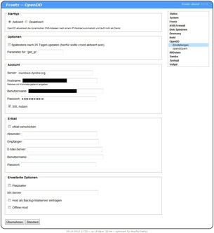

OpenDD
======

OpenDD ist ein Client um dynamische DNS Einträge zu aktualisieren.
Vorteil gegenüber [inadyn](../inadyn-mt/README.md) ist, dass sich OpenDD
nicht ständig im Arbeitsspeicher befindet sondern nur nach einem
Reconnect gestartet wird. Es kann eine eMail bei IP-Wechsel versendet
werden. Ausgaben werden über Syslog ausgegeben

nach 25 Tagen Updaten
---------------------

Diese Option sollte man wählen, wenn sich die IP längere Zeit nicht
ändert, wie es bei Kabelinternet Anbietern üblich ist. Dadurch wird
vermieden, dass nach 1 Monat der Hostname deaktiviert wird. Sollte die
Box länger nicht neu gestartet werden bitte noch "cron" einschalten,
damit die Überprüfung erfolgt. Der Eintrag für cron wird von OpenDD
automatisch erstellt.
Nach solch einem erzwungenen Update wird die Datei
`/tmp/flash/opendd/opendd.onforcedupdate` ausgeführt. Damit kann zB ein
Skript zum Einloggen auf der DynDns-Webseite ausgeführt werden, um eine
Sperre des Domainnamens zu verhindern. Dies Skript muss aber zusätzlich
von [onlinechanged](../onlinechanged/README.md) ausgeführt werden!
Beispielskripte:
[http://forum.mbremer.de/viewtopic.php?f=62&t=1756&p=24340#p24340](http://forum.mbremer.de/viewtopic.php?f=62&t=1756&p=24340#p24340)

get_ip Parameter
-----------------

Hiermit wird konfiguriert wie die externe IP ermittelt wird. Ab
Trunk-Version
[r7376](https://trac.boxmatrix.info/freetz-ng/changeset/7376) wird get_ip an [zentraler
Stelle](mod.html#get_ip) konfiguriert, wodurch diese Option bei
opendd entfällt.

Account
-------

Hier werden die Daten des DNS-Kontos eingetragen:

  -------------- ------------------------------------------------------------------------------
  Server         Angabe des genutzten DNS-Providers (z.B. Dyndns: members.dyndns.org)
  Hostname       Der DNS-Name, für den man sich registriert hat (z.B. Musterman.heimnetz.org)
  Benutzername   Der Benutzername des Accounts
  Passwort       Das Passwort des Accounts
  SSL nutzen     Wenn der Account verschlüsselt aktualisiert werden soll (Port 443)
  -------------- ------------------------------------------------------------------------------

Das SSL-Zertifikat findet sich in der Buildumgebung unter:
`.../freetz-trunk/packages/target-mipsel_uClibc-0.9.29/opendd-0.7.9/root/etc/default.opendd/opendd.pem`

E-Mail
------

In diesem Abschnitt kann eine E-Mail-Benachrichtigung eingerichtet
werden:

  ------------------- --------------------------------------------------------------------------------------------------
  eMail verschicken   Mit dieser Option wird das Versenden des Statusreports aktiviert/ deaktiviert
  Absender            E-Mail-Adresse, mit welcher der Report versendet werden soll (z.B. Musterman@internet.de)
  Empfänger           E-Mail-Adresse, an die der Report gesendet werden soll (kann die gleiche wie Absender sein)
  E-Mail-Server       Postausgangs-Server des Absender-Accounts (z.B. für Freenet: mx.freenet.de)
  Benutzername        Benutzername des Absender-Accounts
  Passwort            Passwort des Absender-Accounts
  Timeout             Wie lange auf eine Antwort des E-Mail Servers gewartet wird (nur Freetz, [#2132](https://trac.boxmatrix.info/freetz-ng/ticket/2132))
  max. Versuche       Maximale Anzahl an Versuchen den E-Mail Server zu erreichen (nur Freetz, [#2132](https://trac.boxmatrix.info/freetz-ng/ticket/2132))
  ------------------- --------------------------------------------------------------------------------------------------

