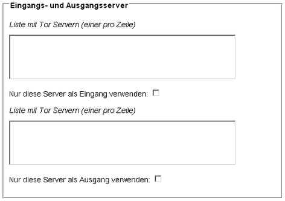
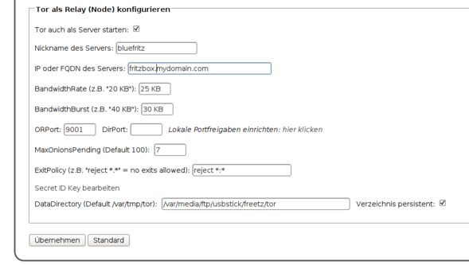

Tor Proxy
=========

Tor ist ein **anonymes Kommunikationssystem** für das Internet, mit dem
man **verschlüsselt** und **sicher surfen** kann. Die Installation eines
Tor Proxy auf der Fritzbox ermöglicht den Schutz der eigenen
Privatsphäre. Auf der Tor Webseite bekommt man einen guten
[Überblick über die Funktionsweise von
Tor](http://tor.eff.org/overview.html.de).

Das Tor Proxy Paket enthält neben einem vorkompilierten Tor Proxy
außerdem eine einfache Clientkonfiguration sowie ein kleines Webfrontend
zur Konfiguration der wichtigsten Parameter und zur Einrichtung eines
Tor-Servers.

Tor als Proxy benutzen
----------------------

Tor ist ein [SOCKS
Proxy](http://de.wikipedia.org/wiki/SOCKS). Jede Anwendung,
die das SOCKS Protokoll beherrscht, kann so konfiguriert werden, dass
die Internetverbindungen über Tor aufgebaut werden. Die Tor
Dokumentation gibt zahlreiche Beispiele, wie man [Anwendungen
torifiziert](https://trac.torproject.org/projects/tor/wiki/doc/TorifyHOWTO).

Für Anwender von Firefox stehen nützlichen Add-Ons wie
[Torbutton](https://addons.mozilla.org/firefox/2275/)
und [FoxyProxy](http://foxyproxy.mozdev.org) zur
Auswahl, mit denen man die Verbindung über den Tor Proxy mit wenigen
Klicks konfigurieren kann.

Zum Surfen mit einem Web Browser kann man auch Tor zusammen mit
[Privoxy](../privoxy/README.md) zu betreiben, damit eine vollständige
Anonymität beim Surfen gewährleistet ist. Privoxy ist ebenfalls als
Freetz Paket verfügbar. Alternativ zu Privoxy kann man auch
[Switchproxy](http://tor.eff.org/docs/tor-switchproxy.html)
für Windows und Mac OS verwenden.

Ob die Verbindung tatsächlich über das Tor Netzwerk läuft, kann man am
einfachsten mit dem [Tor
Detector](http://torcheck.xenobite.eu/) überprüfen.

Tor und Privoxy
---------------

Für die Verwendung mit Privoxy muss sicher gestellt sein, dass der Tor
Proxy entweder auf der lokalen Adresse (Einstellung *127.0.0.1*) oder
auf allen Adressen (Einstellung *0.0.0.0*) gebunden ist. Außerdem muss
der Zugriff von der lokalen Adresse *127.0.0.1* auf jeden Fall erlaubt
sein.

Installation
------------

Einfach beim Erstellen in
[menuconfig](../help/howtos/common/install/menuconfig.html) Tor
mit auswählen.

Geschwindigkeit optimieren
--------------------------

Ab der Version 0.5 ist die "Optimierung der Tor-Geschwindigkeit"
möglich, so wie es ursprünglich
[hier](http://web.archive.org/web/20070427080156/http://www.barbarakaemper.de/krypto/anonym-surfen_onion_router_tor3.htm)
beschrieben wurde. Wer sich die Server lieber selbst aussuchen möchte,
findet außerdem
[hier](http://torstatus.kgprog.com/) oder
[hier](https://torstat.xenobite.eu/) Listen mit
aktiven Tor Servern und deren Standorten.

Die Entry- und Exit-Nodes müssen hierbei mit deren TOR-Alias angegeben
werden also z.B. "blutmagie" und "chaoscomputerclub23". Andere
Versuche wie IP oder DNS-Namen fruchten hier nicht.

Tor als Server einrichten
-------------------------

Wenn Tor als Server betrieben wird, beteiligt sich die FritzBox am
Routing des Datenverkehrs im Tor-Netzwerk und trägt dazu bei, dass das
Netzwerk leistungsfähiger wird. Über die Grundlagen kann und sollte man
sich auf der
[Dokumentationsseite](http://www.torproject.org/docs/tor-doc-relay.html.de)
des Tor-Projekts informieren. Da über das Web-Interface derzeit die
Parameter für die Begrenzung der täglichen, wöchentlichen oder
monatlichen Gesamtdatenmenge (noch) nicht konfigurierbar sind, sollten
nur Flatrate-Nutzer einen Tor-Server einrichten.

Damit der Tor-Server stabil läuft, muss für die FritzBox ein
Swap-Speicher eingerichtet werden (siehe [Howto Swap-File
einrichten](../help/howtos/common/create_swap.html)). Die
wichtigsten Optionen für den Server-Betrieb sind über das Web-Interface
konfigurierbar:

Die Optionen entsprechen denjenigen in der Konfigurationsdatei torrc.
Der Nickname des eigenen Servers ist frei wählbar. Wenn keine IP oder
FQDN angegeben wird, versucht Tor, die eigene IP-Adresse selbst
herauszufinden. Zuverlässiger ist aber die Angabe eines FQDN der
FritzBox, der z.B. über DynDNS eingerichtet und per
[inadyn](../inadyn-mt/README.md) automatisch aktualisiert werden kann.

Wichtig für den Betrieb des Tor-Servers sind die Optionen BandwidthRate
und BandwidthBurst, über man die Bandbreite einstellt, die dem
Tor-Netzwerk zur Verfügung gestellt wird. Da Tor im Server-Betrieb
relativ ressourcenhungrig ist, sollte hier nicht übertrieben werden,
selbst wenn mehr Bandbreite vorhanden ist (entscheidend ist der Upload).
Gleiches gilt für die Option MaxOnionsPending. Wird hier ein zu hoher
Wert eingestellt, kann es zu Reboots der FritzBox kommen. Ein Wert unter
10 hat sich auf einer FritzBox 7170 bewährt.

Der ORPort ist der Port, über den der Tor-Server von außen erreichbar
sein muss. Daher muss für den ORPort eine lokale Portfreigabe auf
0.0.0.0 eingerichtet werden. Das geht am einfachsten über das
Freetz-Paket [avm-firewall](../avm-firewall/README.md). Ein DirPort muss
nicht angegeben werden (dann wird kein DirectoryService bereitgestellt,
was für den Betrieb des Tor-Servers auch nicht erforderlich ist und
Ressourcen spart).

**Achtung:** In der Standard-Konfiguration läuft Tor nur als Entry- oder
MiddleNode, aber [nicht] als ExitNode. Dies bedeutet, dass
kein anderer Tor-Nutzer mit der externen IP-Adresse der FritzBox im
Internet surft und daher die eigene IP-Adresse auch nicht in
irgendwelchen Server-Logs auftaucht. Wer das ändern möchte und genau
weiß, was er macht, kann die ExitPolicy ändern.

Der Secret ID-Key des Tor-Servers muss normalerweise nicht bearbeitet
werden. Der Secret ID-Key wird beim ersten Start des Tor-Servers
automatisch generiert und beim Beenden im Flash-Speicher der Box
abgespeichert. Über die Optionen "DataDirectory" / persistent kann das
Verzeichnis angegeben werden, in dem Tor die zum Server-Betrieb
erforderlichen Daten speichert. Auch die Daten, die für den Client-Modus
benötigt werden (insbes. das aktuelle Verzeichnis der erreichbaren
Tor-Knoten), werden hier abgespeichert. Man kann z.B. ein Verzeichnis
auf einem USB-Speicher angegeben (sofern das Verzeichnis nicht vorhanden
ist, wird es erstellt).

Remote Control
--------------

For remote controlling Tor you can use
[Vidalia](http://www.torproject.org/projects/vidalia.html.en).

Configuration for the Tor server on your box:

-   Control Port: 9051 (the default port, you can use any port you like)
-   Control Interface: 192.168.178.1
-   Control Password Hash:
    -   generate on your box with *tor ---hash-password your_password*
    -   copy the whole last line

Vidalia configuration:

-   Address/ Port of Tor Instance: 192.168.178.1/9051 (should match that
    of the server)
-   Tor Password: plain, un-hashed password

obfsproxy
---------

-   [Information](https://www.torproject.org/projects/obfsproxy)
-   Patch in ticket [#1712](https://trac.boxmatrix.info/freetz-ng/ticket/1712)

Memory Usage
------------

Huge.

After ten minutes:

  ---------- ---------
  VmSize     VmRSS
  17284 kB   8660 kB
  ---------- ---------

Abhängigkeiten
--------------

Tor benötigt die Bibliotheken zlib, openssl und libevent. Diese sind
ebenfalls in den aktuellen Freetz-Versionen enthalten und werden
automatisch mit installiert, sobald man im menuconfig das TOR Package
auswählt.

Diskussion
----------

Fragen und Anmerkungen zu diesem Package werden vorzugsweise in diesem
[Thread](http://www.ip-phone-forum.de/showthread.php?p=693909#post693909)
diskutiert.

