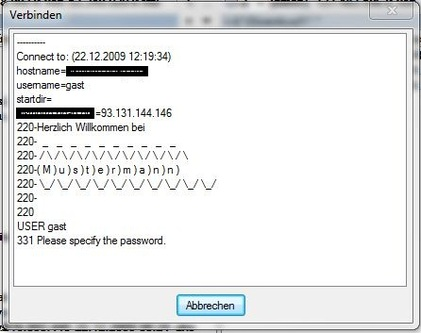
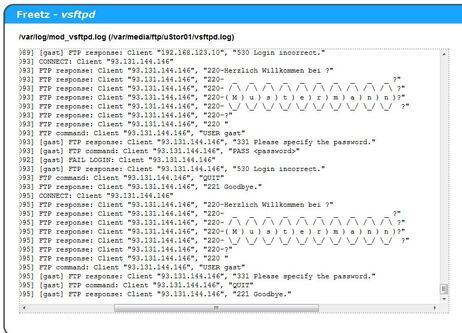

# vsftpd 3.0.3

**vsFTP** steht für **v**ery **s**ecure **F**ile **T**ransfer
**P**rotocol. Der
[vsftpd](http://vsftpd.beasts.org/) bietet z.B.
folgende Features:

-   virtuelle IPs
-   virtuelle User
-   Konfiguration pro User, pro Source-IP
-   Limits pro Source-IP
-   Bandweitenbeschränkung ([Bandwidth
    throttling](http://en.wikipedia.org/wiki/Bandwidth_throttling))
-   IPv6
-   SSL Verschlüsselung

Package ins Image einbinden
---------------------------

Im menuconfig unter `Package selection ---> Standard packages --->`
findet sich

-   *Vsftpd 2.x.y*
    Damit wird der FTP-Zugriff über vsFTP möglich.

Verwandte Themen
----------------

Unter `Patches --->` findet sich

-   *Patch USB storage names* ... mit zusätzlichen Unterpunkten.
    Hierdurch wird dem USB-Speicher ein einheitlicher Name gegeben.
-   *Execute autorun.sh/autoend.sh script on (un)mount*
    Führt die entsprechenden Skripte beim An- und Abstecken des
    USB-Speichers aus.

Freigaben und Benutzer für vsFTP in Freetz einrichten
-----------------------------------------------------

Es folgt eine ausführliche Anleitung für das Erstellen von FTP-Freigaben
und Nutzern mit verschiedenen Lese/Schreib-Rechten, die unabhängig von
Linux-Zugriffsrechten funktioniert und somit auch für FAT- und
NTFS-Platten eingesetzt werden kann. Hierbei können mit dem aktuellen
Linux Kernel jedoch nur Lese/Schreib-Rechte auf Benutzer- und nicht auf
Ordnerebene gesetzt werden.

Hier eine Übersicht über die in dieser Anleitung erstellten Ordner mit
Zugangsbeschränkungen für zwei reguläre Nutzer (user1, user2) und einen
Gast-Account (gast).

-   **Ordner → Zugangsberechtigte Benutzer**
-   user1 → user1
-   user2 → user2
-   shared → user1, user2
-   public → user1, user2, gast

Diese können leicht an den eigenen Bedarf angepasst werden.

#### Order-Struktur auf der USB-Platte wird vorbereitet.

Dazu die folgenden Ordner im Hauptverzeichnis der Platte erstellen:

```
user1        #Heimverzeichnis user1
user1/shared
user1/public
user2        #Heimverzeichnis user2
user2/shared
user2/public
shared       #gemeinsamer Ornder user1, user2
public       #Heimverzeichnis gast
```

#### Die AVM-Lösungen von FTP wird abgeschaltet.

*fritz.box* → *Einstellungen* → *Erweiterte Einstellungen* →
*USB-Geräte* → *USB-Speicher* *USB-Speicher FTP-Zugriff aktivieren* →
Häkchen weg.
Dies ist nicht zwingend notwendig, sofern der vsftpd auf einem anderen
als Port 21 läuft.

#### Diensteinstellungen werden im Freetz-Menü eingestellt.

*Pakete* → *vsftpd*

*Starttyp* → automatisch

→ *Zugriff*

```
[ ]Anonymes FTP
[X]Lokale Benutzer
[X]chroot jail
[ ]Erlaube root login
[ ]Erlaube ftpuser login
```

So ist sichergestellt, dass nur die genannten Nutzer und diese nur auf
ihr Verzeichnis zugreifen können.
Wenn der AVM FTP-Server parallel genutzt wird, **muss** hier auch der
Haken bei **Erlaube ftpuser login** gesetzt werden.

→ *Zusätzliche Konfigurationsoptionen (für Experten)*

```
user_config_dir=/var/media/ftp/uStor01/vsftp_user_conf
```

Später werden wir die Schreibrechte für die Benutzer getrennt festlegen.

→*Übernehmen*←

```
Saving settings...done.
Saving vsftpd.cfg...done.

Writing /var/flash/freetz...done.
10752 bytes written.
```

#### TelNet-Zugang wird gestartet.

*Dienste* → *telnetd* → *start*

Nun geht es auf der Kommandozeile weiter.

#### Die lokalen Benutzer werden eingerichtet.

Jeder Benutzer erhält dabei ein explizites Heim-Verzeichnis welches von
vsFTP automatisch übernommen wird.

```
adduser -h /var/media/ftp/uStor01/user1 user1
adduser -h /var/media/ftp/uStor01/user2 user2
adduser -h /var/media/ftp/uStor01/public gast
```

```
/var/media/ftp/uStor01/ # adduser -h /var/media/ftp/uStor01/user1/ user1
adduser: /var/media/ftp/uStor01/user1/: File exists
Changing password for user1
New password:
Retype password:
Password for user1 changed by root
/var/media/ftp/uStor01/ # adduser -h /var/media/ftp/uStor01/user2/ user2
adduser: /var/media/ftp/uStor01/user2/: File exists
Changing password for user2
New password:
Retype password:
Password for user2 changed by root
/var/media/ftp/uStor01/ # adduser -h /var/media/ftp/uStor01/public/ gast
adduser: /var/media/ftp/uStor01/public/: File exists
Changing password for gast
New password:
Retype password:
Password for gast changed by root
```

Die neuen Zugangsdaten werden erstmal gespeichert.

```
modsave all
```

```
/var/media/ftp/uStor01/technik # modsave all
Saving users, groups and passwords...done.
Saving config...done.
Writing /var/flash/freetz...done.
10752 bytes written.
```

#### Die Verzeichnisse *shared* und *public* werden in die jeweiligen Heim-Verzeichnisse der Benutzer eingebunden.

Dies soll immer sichergestellt werden, wenn die USB-Platte an die
FritzBox angeschlossen wird. Dazu wird die Datei *autorun.sh* im
Hauptverzeichnis der USB-Platte erstellt. Dass nach ordnungsgemäßem
Abhängen der Platte die mounts auch wieder entfernt werden schreiben wir
unmount-Befehle in die *autoend.sh*.

*/var/media/ftp/uStor01/autorun.sh*

```
mount -o bind /var/media/ftp/uStor01/shared /var/media/ftp/uStor01/user1/shared
mount -o bind /var/media/ftp/uStor01/shared /var/media/ftp/uStor01/user2/shared

mount -o bind /var/media/ftp/uStor01/public /var/media/ftp/uStor01/user1/public
mount -o bind /var/media/ftp/uStor01/public /var/media/ftp/uStor01/user2/public
```

*/var/media/ftp/uStor01/autoend.sh*

```
umount /var/media/ftp/uStor01/user1/shared
umount /var/media/ftp/uStor01/user2/shared

umount /var/media/ftp/uStor01/user1/public
umount /var/media/ftp/uStor01/user2/public
```

#### FTP-Schreibrechte für die Benutzer werden gesetzt.

Dazu erhält jeder Benutzer eine Datei mit seinem Dateinamen im Ordner
*/var/media/ftp/uStor01/vsftp_user_conf/*, die festlegt, ob er
Schreibrechte hat oder nicht.

*/var/media/ftp/uStor01/vsftp_user_conf/user1*

```
write_enable=yes
```

*/var/media/ftp/uStor01/vsftp_user_conf/user2*

```
write_enable=yes
```

*/var/media/ftp/uStor01/vsftp_user_conf/gast*

```
write_enable=no
```

Über diese Benutzerdateien ist es auch möglich einzelne FTP-Befehle
([Liste](http://en.wikipedia.org/wiki/List_of_FTP_commands))
für Benutzer zu verbieten. Hierzu fügt man folgende Zeile in die Datei
ein und entfernt die nicht gewünschten Befehle:

```
cmds_allowed=ABOR,ACCT,ALLO,APPE,AUTH,CDUP,CWD,DELE,EPRT,EPSV,FEAT,HELP,LIST,MDTM,MKD,MODE,NLST,NOOP,OPTS,PASS,PASV,PBSZ,PORT,PROT,PWD,QUIT,REIN,REST,RETR,RMD,RNFR,RNTO,SITE,SMNT,STAT,STOR,STOU,STRU,SYST,TYPE,USER
```

Alternativ kann man auch einzelne FTP-Befehle verbieten (ab vsftpd
Version 2.1.0):

```
cmds_denied=DELE,RMD
```

**Hinweiß:** Wenn wie Oben beschrieben das verbieten von Befehlen über
**cmds_denied=** nicht Funktioniert hat, gibt es noch einen zweiten Weg
das Ausführen von Befehle für einige User zu verbieten.

Gelöst wird das ganze ebenfalls über die Benutzerdateien. Hierzu fügt
man folgende Zeile in die Datei ein und **entfernt** die Befehle die der
User nicht ausführen darf:

```
cmds_allowed=ABOR,ACCT,ALLO,APPE,AUTH,CDUP,CWD,DELE,EPRT,EPSV,FEAT,HELP,LIST,MDTM,MKD,MODE,NLST,NOOP,OPTS,PASS,PASV,PBSZ,PORT,PROT,PWD,QUIT,REIN,REST,RETR,RMD,RNFR,RNTO,SITE,SMNT,STAT,STOR,STOU,STRU,SYST,TYPE,USER
```

**Beispiel:** user1 darf Dateien auf den FTP kopieren und Verzeichnisse
anlegen, jedoch diese nicht wieder löschen. Also muß folgendes in der
Datei stehen:

```
cmds_allowed=ABOR,ACCT,ALLO,APPE,AUTH,CDUP,CWD,EPRT,EPSV,FEAT,HELP,LIST,MDTM,MKD,MODE,NLST,NOOP,OPTS,PASS,PASV,PBSZ,PORT,PROT,PWD,QUIT,REIN,REST,RETR,RNFR,RNTO,SITE,SMNT,STAT,STOR,STOU,STRU,SYST,TYPE,USER
```

> **DELE** (Delete file), **RMD** (Remove a directory) wurden aus dem
> oben angegebenen String gelöscht.
> 
> 
> Sollte etwas immer noch nicht gehen, dann einfach mal den Router neu
> starten.( Reboot der FritzBox )

Eine Liste aller FTP-Befehle und ihre Bedeutung findet ihr hier:
[Liste](http://en.wikipedia.org/wiki/List_of_FTP_commands)

#### Das wars!

Die Ordner sind nun per FTP
([ftp://fritz.box](ftp://fritz.box)) mit den
gegebenen Zugangsdaten erreichbar.

Anmeldebildschirm bei vsftpd ändern
-----------------------------------

Hier wird nun kurz beschrieben wie ihr den Anmeldebildschirm von VSFTP
ändern bzw. anpassen könnt.
1.) Folgende Datei erzeugen:
Name: **ftp-startbild**
Inhalt:

```
Herzlich Willkommen bei
  _   _   _   _   _   _   _   _   _
 /  /  /  /  /  /  /  /  /  / 
( M ) u ) s ) t ) e ) r ) m ) a ) n ) n )
 _/ _/ _/ _/ _/ _/ _/ _/ _/ _/
```

Sehr hilfreich bei der Erzeugung des Schriftzuges ist diese Seite:
[AsciiArt
Generator](http://www.ihr-freelancer.de/asciiart)
(Schriftart:Bubble)
2.) Diese Datei wird dann einfach auf Eurer Festplatte abgelegt.
Ort: **/var/media/ftp/uStor01/**
3.) Nun muß diese Datei nur noch über das WebIF ins Freetz eingebunden
werden.
hierzu wird nun im Freetz-WebIF das VSFTP-Menue aufgerufen und folgender
Eintrag unter **Zusätzliche Konfigurationsoptionen (für Experten)**
eingetragen.

```
banner_file=/var/media/ftp/uStor01/ftp-startbild
```

[](../../README/screenshots/126.jpg)

4.) Nun nur noch Übernehmen und schon sollte sich Eure Box / der FTP mit
dem neuen Anmeldebildschirm melden.

[](../../README/screenshots/127.jpg)

[](../../README/screenshots/128.jpg)


Weiterführende Links
--------------------

-   [Project Homepage](http://vsftpd.beasts.org/)
-   [IPPF
    Thread](http://www.ip-phone-forum.de/showthread.php?t=176105):
    Aktives/passives FTP auf die Box von außen mit *vsftpd* auf der Box
-   [IPPF
    Thread](http://www.ip-phone-forum.de/showthread.php?t=187488):
    vsFTP und Samba mit Benutzerrechten für FAT32-USB-Platte

